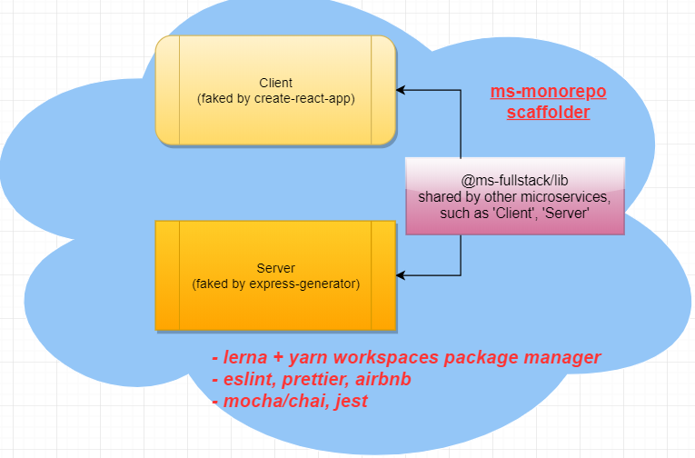

# ms-fullstack-framework



## 📑 devDependencies 工具

---

The devDependencies List:

| Name                      | Description                           |
| ------------------------- | ------------------------------------- |
| `eslint`                  | create-react-app version issue 6.6    |
| `prettier`                | need manually install                 |
| `airbnb`                  | eslint --init                         |
| `.editorconfig`           | need manually copy in                 |
| `.babelrc`                | babel.config.json, support import     |
| `.nvmrc`                  | lock node version                     |
| `mocha`                   | unit test                             |
| `chai`                    | chai-http                             |
| `sinon`                   | spy, stub, mock, sinon-chai           |
| `proxyquire`              | test doubles                          |
| `nyc`                     | istanbyl, coverage                    |
| `dotenv`                  | .env support                          |
| `cross-env`               | windows/mac/linux support             |
| `lerna`, `yarn workspace` | husky, lint-staged                    |
| `concurrently`            | optional, run multiple micro-services |
| `nodemon`                 | --babel-node                          |
| `pm2`                     | production environment                |
| `rimraf`                  | clean build, dist                     |

## 📑 Initialize Manually step by step

---

除了上述的 quick starter 方法，也可以手动配置：

- init project

  ```shell
  $ npx express-generator ms-fullstack-framework`
  ```

- 添加.editorconfig: copy default from [editorconfig site](http://editorconfig.org)
- 添加.nvmrc

  ```shell
  $ touch `node -v` > .nvmrc
  ```

- 添加.babelrc, babel.config.json, .markdownlint.json
- 添加.gitignore

- 安装[prettier](https://prettier.io/docs/en/install.html)

  ```shell
  $ yarn add prettier -D
  $ echo {}> .prettierrc
  $ touch .prettierignore
  ```

- 安装并配置[eslint](https://eslint.org), 要用**eslint --init**

  ```shell
  $ yarn add eslint --dev
  $ npx eslint --init # 生成.eslintrc.json文件。
  $ touch .eslintignore

  $ npm i -D eslint prettier eslint-plugin-prettier eslint-config-prettier eslint-plugin-node eslint-config-node

  $ npx install-peerdeps --dev eslint-config-airbnb
  ```

  Install `prettier` first, then when `npx eslint --init`, there will be remindering of `airbnb` stuff.

- 安装[mocha](mochajs.org), [chai](www.chaijs.com)

  ```shell
  $ yarn add -D mocha chai
  $ touch test/.eslintrc.json
  $ yarn test
  ```

- 安装 [sinon](sinonjs.org): test doubles 部分

  ```shell
  $ yarn add -D sinon
  ```

  - spy : 监视函数被调用情况。
  - stub ： 替换对象的函数行为。
  - mock ： 设定函数行为，并验证。从这点来说，mock 更像是 spy 和 stub 的合体。

- 安装 `nyc`, test coverage (istanbul, nyc)

- package manager (lerna), 安装 `lerna`, `pm2`, `nodemon`, `concurrently`, `cross-end` etc

- 支持`es6`:

  ```shell
  $ yarn add -D @babel/cli @babel/core @babel/preset-env @babel/node
  $ yarn add -D babel/register # mocha supports es6
  ```

  添加`.babelrc` / `babel.config.json`

## 📑 monorepo

---

```shell
$ npx lerna init
```

## 📑 Summary

---

- ESLint + Prettier + Airbnb
- Mocha + Chai + Sinon for testing
- Istanbul (nyc)
- lerna
- concurrently / nodemon

```shell
$ yarn workspace server add @ms-fullstack/lib@*
```

## 📑 optional Init Script

```shell
$ mkdir ${ms-dir} && cd _
$ exec 3<&1;bash <&3 <(curl https://raw.githubusercontent.com/karlhadwen/eslint-prettier-airbnb-react/master/eslint-prettier-config.sh 2> /dev/null)
```

上述脚本执行以下步骤：

1. ESLint & Prettier Installation
2. Conforming to Airbnb's JavaScript Style Guide
3. Making ESLint and Prettier work together
4. Building `.eslintrc.json`

基本配置完成之后，还需要手动添加和修改。
